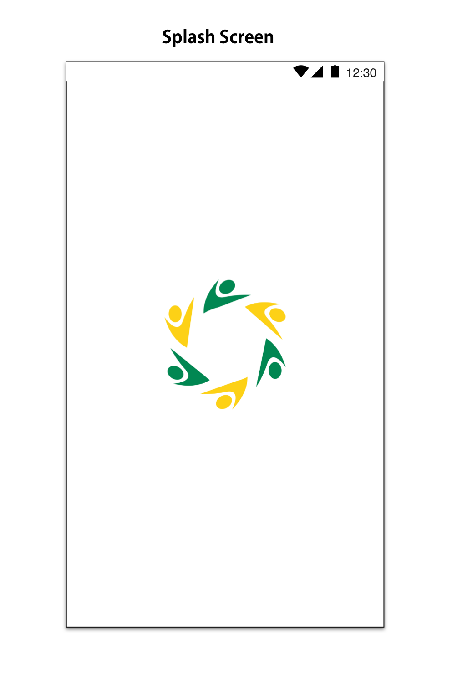
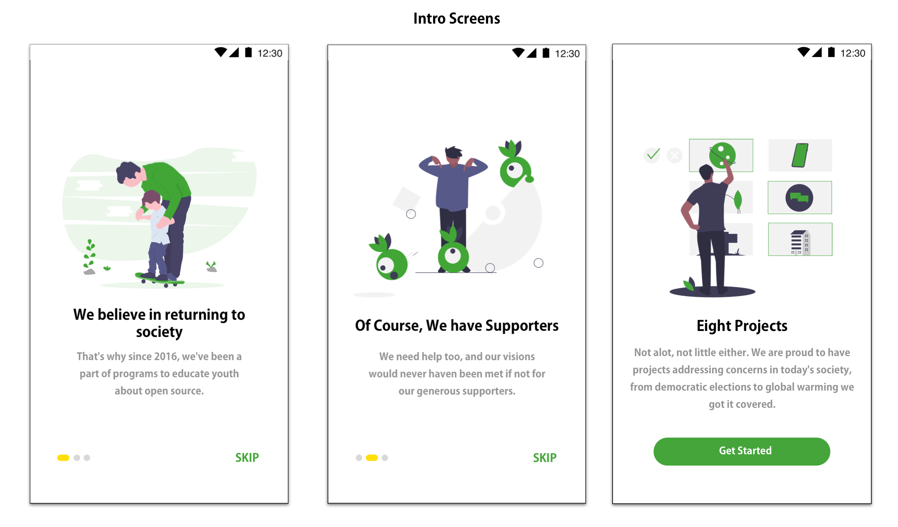
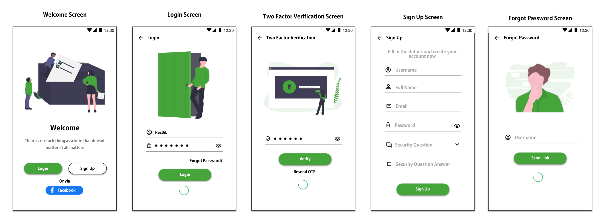
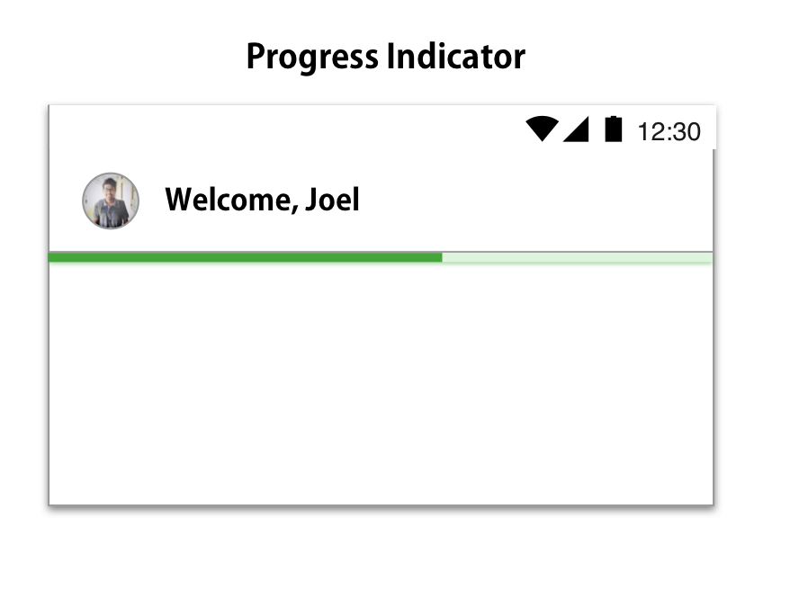
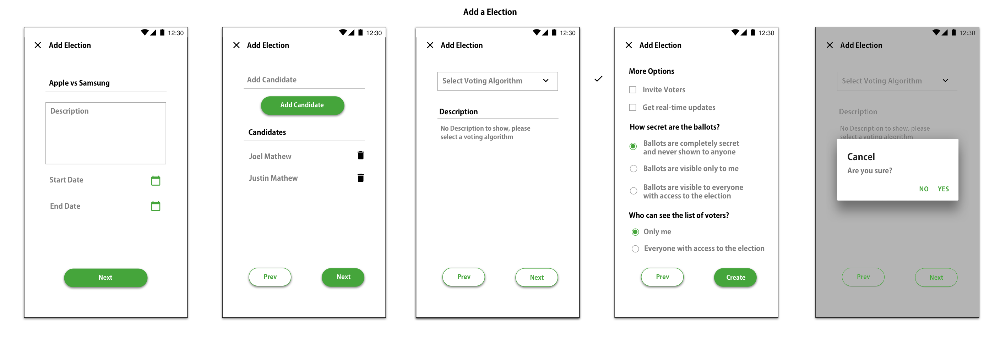
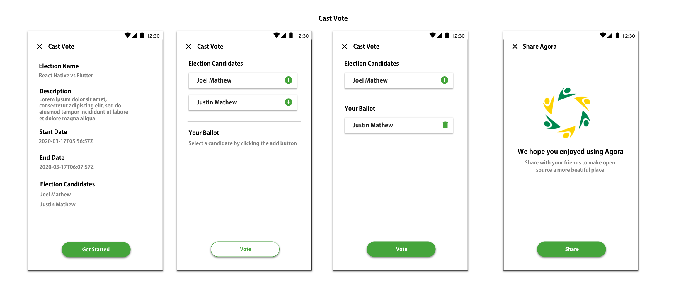
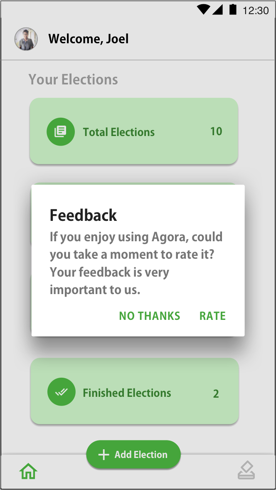

# Agora-Prototype
Agora Vote UI prototype for GSoC prototype.

<a href="https://gitlab.com/aossie/agora-android/-/merge_requests/202">UI Mockups</a>

<a href="screenshots.md">Prototype Screenshots</a>

<a href="https://appetize.io/app/1a2uub7n3cj7evxk1haez981ug?device=pixel4&scale=75&orientation=portrait&osVersion=10.0">App demo (Appetize) </a>
It is a debug build (and not final) (for latest changes, clone repo and build the app)

**Plan for CI/CD with Google Play**
* When the deploy branch is merged into the master branch using fastlane a production ready apk sent to Google Play console.
* <a href=".gitlab-ci.yml">CI Config file (its just for illustration and is not complete)</a>
* Tools to be used (GitLab CI, Fastlane, Gradle and Google Play Console)

**Libraries I used in the prototype**

* <a href="https://github.com/GrenderG/Toasty">Toasty</a>
* <a href="https://github.com/hdodenhof/CircleImageView">CircleImageView</a>

**App Theme**

* The app theme is kept light since it is the UI trend nowadays in android material design with shades of green(#45A53B) for buttons, relevant text, etc.
* Keeping the theme light can also help in implementing dark theme later.
* The font I used is Adobe Gothic Std

**Splash Screen**

**Intro Screens**

The intro screeens will only be shown the first time the app is installed. First time users will have an idea what the apps does and how the app can help them.
For illustration I took content from the Aossie website.

**Authentication Screens**

**Main Screens**

* The user will feel welcomed when he opens the app.
* Bottom Navigation Bar will hold navigation to Home, add new election and Election Screen.
* When the user clicks on the profile picture on the AppBar a SlidingDrawer will appear from the bottom of the screen with buttons for navigating to the Profile Settings, Contact us and so on.
* In the election screen the user will be able to move through different categories in elections such as active ,pending and finished.
* The election details will be displayed in a card with a expand option to view more details. When the user clicks on OPTIONS in the expanded card a bottom sheet will appear with options to invite voters, add voters, view result and delete election.
* The reason I used expanded cards is to avoid having a complete new screen just for showing the extra election details and options.

The home screen will have a pull down to refresh feature and the loading indicator will be below the appbar indicating to the user that the election details are being loaded.

**Add Election**

* The user will have to navigate through three screens where he/she has to set the election details.
* If the user wants to change some previous data he/she can navigate to the previous screen using the prev button.
* The next button will only be enabled if the user enters mandatory fields (button with green border and no fill)
* If the user in the middle wants to cancel the election creation by clicking on the cancel button in AppBar, a confirmation dialog pops to confirm the decision in order to avoid mistake cancellation.

**Cast Vote**

* The first screen briefs the user on the details of the election.
* In the second screen, the user will select candidates for his or her ballot.
* The Vote button will be disabled if the user's ballot is empty.
* After the user gives the vote,the final screen will allow the user to share the Agora with others.

**Profile Settings Screen**

**Feedback**

* Feedback is very important for any app, this can help us improve our app.
* The user will be redirected to play store where he/she can submit a review on Agora.

