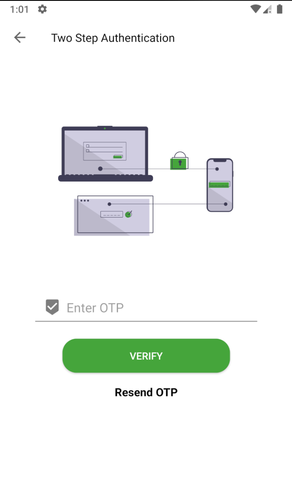
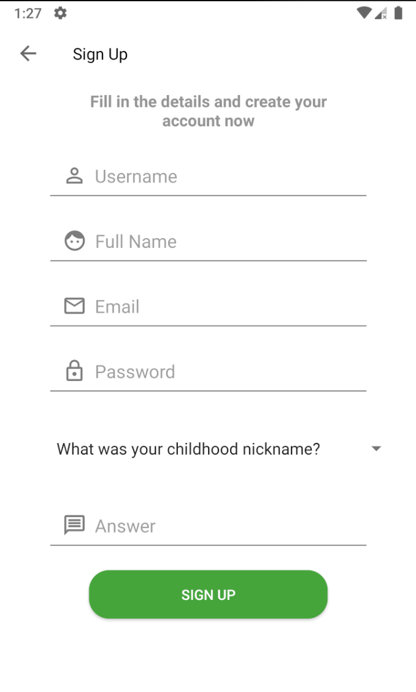
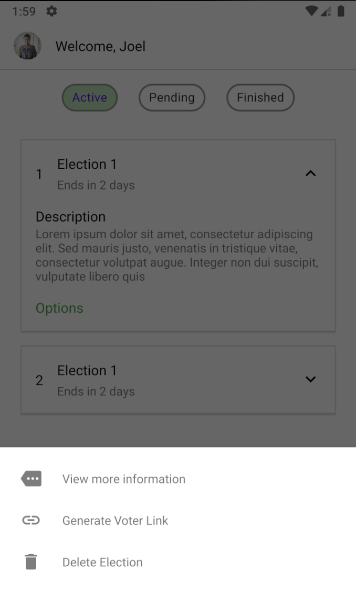
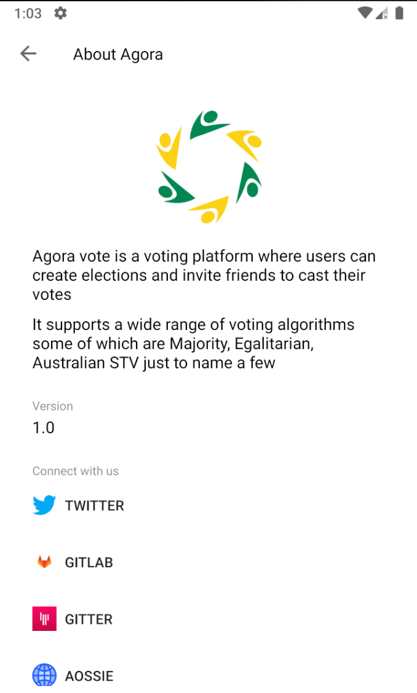

# Agora-Prototype
Agora Vote UI prototype for GSoC prototype.

<a href="https://gitlab.com/aossie/agora-android/-/merge_requests/202">UI Mockups</a>

<a href="https://appetize.io/app/1a2uub7n3cj7evxk1haez981ug?device=pixel4&scale=75&orientation=portrait&osVersion=10.0">App demo (Appetize) </a>
It is a debug build (and not final) (for latest changes, clone repo and build the app)

**Plan for CI/CD with Google Play**
* When the deploy branch is merged into the master branch using fastlane a production ready apk sent to Google Play console.
* <a href=".gitlab-ci.yml">CI Config file (its just for illustration and is not complete)</a>
* Tools to be used (GitLab CI, Fastlane, Gradle and Google Play Console)

**Libraries I used in the prototype**

* <a href="https://github.com/GrenderG/Toasty">Toasty</a>
* <a href="https://github.com/hdodenhof/CircleImageView">CircleImageView</a>

**Screenshots for the prototype**

<table class="tg">
  <tr>
    <td><kbd></kbd></td>
    <td><kbd></kbd></td>
    <td><kbd></kbd></td>
    <td><kbd></kbd></td>
  </tr>
  <tr>
    <td><kbd></kbd></td>
    <td><kbd></kbd></td>
    <td><kbd></kbd></td>
    <td><kbd></kbd></td>
  </tr>
  <tr>
    <td><kbd></kbd></td>
    <td><kbd></kbd></td>
    <td><kbd></kbd></td>
    <td><kbd></kbd></td>
  </tr>
  <tr>
    <td><kbd></kbd></td>
    <td><kbd></kbd></td>
    <td><kbd></kbd></td>
    <td><kbd></kbd></td>
  </tr>
  <tr>
    <td><kbd></kbd></td>
  </tr>
</table>
